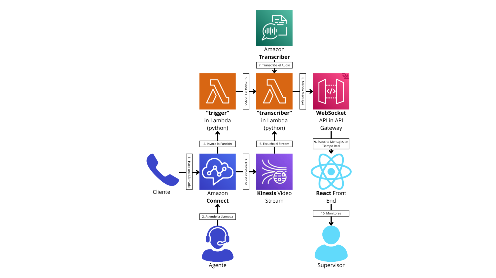

# Websocket para monitoreo de Agentes en Tiempo Real

## Agent Contact Panel:
[https://bebopruebas.my.connect.aws/ccp-v2/softphone](https://bebopruebas.my.connect.aws/ccp-v2/softphone)

## Client Contact Panel:
[https://beborico1.github.io/connect-widget/index.html](https://beborico1.github.io/connect-widget/index.html)

### Prototipo del Componente:


### Arquitectura prevista:


### Flujo de Contacto (para pruebas):


#### Setting Up Live media streaming:

En la sección Data Storage:


#### Permitir funciones Lambda:


#### Ejemplo de evento recibido por la Lambda:

```json
{
  "Details": {
    "ContactData": {
      "Attributes": {
        "streamAudioFromCustomer": "true",
        "transcribeCall": "true",
        "languageCode": "en-US",
        "saveCallRecording": "true",
        "streamAudioToCustomer": "true"
      },
      "AwsRegion": "us-east-1",
      "Capabilities": { "Agent": [Object], "Customer": [Object] },
      "Channel": "VOICE",
      "ContactId": "b373d225-c6c8-48eb-b7ec-e3ce4135a7e9",
      "CustomerEndpoint": null,
      "CustomerId": null,
      "Description": null,
      "InitialContactId": "b373d225-c6c8-48eb-b7ec-e3ce4135a7e9",
      "InitiationMethod": "WEBRTC_API",
      "InstanceARN": "arn:aws:connect:us-east-1:975050025567:instance/a8c17f30-f72c-4900-abd2-8745056c4c99",
      "LanguageCode": "en-US",
      "MediaStreams": {
        "Customer": {
          "Audio": {
            "StartFragmentNumber": "91343852333181432392682062662105165711654869872",
            "StartTimestamp": "1714363529673",
            "StreamARN": "arn:aws:kinesisvideo:us-east-1:975050025567:stream/bebo-connect-bebopruebas-contact-37d6eff1-773f-459b-9ef5-4a90cf3b4723/1714358493195"
          }
        }
      },
      "Name": "Customer",
      "PreviousContactId": "b373d225-c6c8-48eb-b7ec-e3ce4135a7e9",
      "Queue": null,
      "References": {},
      "RelatedContactId": null,
      "SegmentAttributes": {
        "connect:Direction": { "ValueString": "INBOUND" },
        "connect:Subtype": { "ValueString": "connect:WebRTC" }
      },
      "SystemEndpoint": null,
      "Tags": {
        "streamAudioFromCustomer": "true",
        "transcribeCall": "true",
        "languageCode": "en-US",
        "saveCallRecording": "true",
        "streamAudioToCustomer": "true"
      }
    },
    "Parameters": {}
  },
  "Name": "ContactFlowEvent"
}
```

### Código para la Lambda “trigger”:
[...JavaScript code for Lambda trigger...]

### Código para la Lambda “transcriber”:
[...Python code for Lambda transcriber...]

### Formato de Mensajes:

#### Inicial (initialAgentList):
```json
{
  "type": "initialAgentList",
  "data": [
    {
      "agentId": "A123",
      "name": "Agente Uno",
      "status": "available",
      "duration": null,
      "sentimentScore": null
    },
    {
      "agentId": "A124",
      "name": "Agente Dos",
      "status": "on a call

",
      "duration": 4500,
      "sentimentScore": 3.5
    }
    // ... más agentes
  ]
}
```

#### Actualización del Estado del Agente (agentStatusUpdate):
```json
{
  "type": "agentStatusUpdate",
  "data": {
    "agentId": "A123",
    "name": "Jane Doe",
    "status": "offline",
    "duration": null,
    "sentimentScore": null
  }
}
```

[...Additional message formats...]

### Ejemplo de integración en React:
[...React code example...]

### Referencias:
- [Nuestro Figma](https://www.figma.com/file/9zLRtlghtruW6bNxwt1g58/UX?type=design&node-id=0-1&mode=design)
- [AWS Puntuaciones de sentimiento durante las llamadas](https://docs.aws.amazon.com/connect/latest/adminguide/sentiment-scores.html)
- [Amazon Transcribe](https://docs.aws.amazon.com/transcribe/latest/dg/what-is.html)
- [Amazon Transcribe con Websockets](https://aws.amazon.com/es/blogs/machine-learning/transcribe-speech-to-text-in-real-time-using-amazon-transcribe-with-websocket/)
- [Transcribing with HTTP or WebSockets](https://docs.aws.amazon.com/transcribe/latest/dg/getting-started-http-websocket.html)
- [Setting up a streaming transcription](https://docs.aws.amazon.com/transcribe/latest/dg/streaming-setting-up.html)
- [amazon-connect-realtime-transcription](https://github.com/amazon-connect/amazon-connect-realtime-transcription)
- [Provide call sentiment analytics to agents using real-time contact analysis segment streams in Contact Lens for Amazon Connect](https://aws.amazon.com/es/blogs/contact-center/provide-call-sentiment-analytics-to-agents-using-real-time-contact-analysis-segment-streams-in-amazon-connect-contact-lens/)
- [New for Amazon Transcribe – Real-Time Analytics During Live Calls](https://aws.amazon.com/es/blogs/aws/new-for-amazon-transcribe-real-time-analytics-during-live-calls/)
- [Amazon Transcribe Call Analytics](https://aws.amazon.com/transcribe/call-analytics/)


